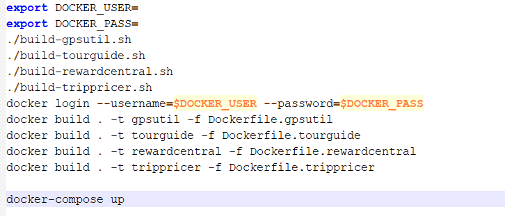
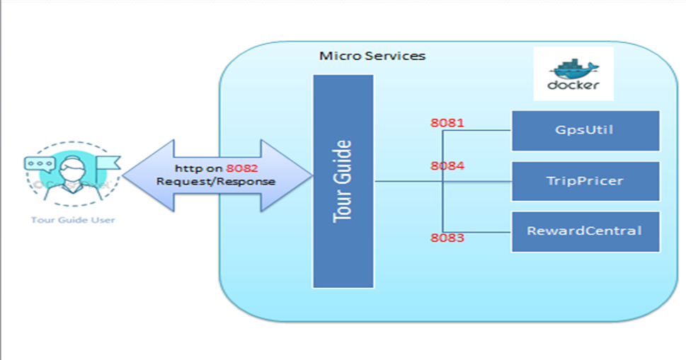

# TourGuide
- TourGuide is a Spring Boot application  intended for the tourism industry. It allows users to see which tourist attractions are nearby and get discounts on hotel stays as well as tickets to different shows.
## Getting Started
- These instructions will get you a copy of the project up and running on your local machine for development and testing purposes.
## Technologies
- Java 11 JDK
- Spring Boot 2.5.4
- Gradle 2.1.6
- Docker
# Installing

1.Install Java:

https://docs.oracle.com/javase/8/docs/technotes/guides/install/install_overview.html

2.Install Gradle

https://gradle.org/install/

3.Install Docker:

https://www.docker.com/products/docker-desktop

After the installation you can test the endpoints with Postman:

https://www.postman.com/downloads/
# Running App
Requirements:
- Before proceeding in running the app you should first add your name and password in the docker-scripts.sh file
- In order to run the dockerized application you need to tab the command below that 
gathers the 4 scripts that build,connect to DockerHub and deploy each one of the 4 microservices applications in one file (presented below) :

      ./docker-scripts.sh

# EndPoints
- To get all the user's names :
      
      - Get http://localhost:8082/getAllUsersNames

- To get user's location :

      - Get http://localhost:8082/getLocation?userName=internalUser78

- To get the List of the 5 closest attractions to the user with their locations and the distance between them

      - Get http://localhost:8082/getNearbyAttractions?userName=internalUser78

- To gather all user's current location based on their stored location history

      - Get http://localhost:8082/getAllCurrentLocations

- To get user rewards

      - Get http://localhost:8082/getRewards?userName=internalUser78

- To update user preferences

      - Put http://localhost:8082/addUserPreferences?userName=internalUser78 

- To get user's TripDeals

      - Get http://localhost:8082/getTripDeals?userName=internalUser78

- To get all user's location

      - Get http://localhost:8082/getAllUsersLocation

# TourGuide Architectural Overview

        